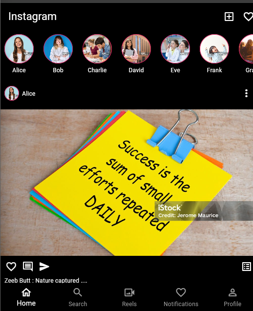

# Instagram Clone

A modern Instagram UI clone built with Flutter. This project demonstrates a clean implementation of the Instagram home feed, including stories and posts, with a dark theme aesthetic.

## 🚀 Features

- **Home Feed**: Scrollable list of posts with user information, images, and interaction icons.
- **Stories Bar**: Horizontal scrollable list of user stories with circular avatars and gradient-style borders.
- **Bottom Navigation**: Fully functional UI for navigating between Home, Search, Reels, Notifications, and Profile.
- **Dark Mode UI**: Sleek black and white design consistent with Instagram's dark theme.
- **Custom Styling**: Implementation of specific fonts and layout structures to mimic the original app.

## 📸 Screenshots

| Home Feed                             

 

| Profile Page 
! [Profile](assets/images/img.png)
]


## 🛠️ Tech Stack

- **Framework**: [Flutter](https://flutter.dev/)
- **Language**: [Dart](https://dart.dev/)
- **Icons**: Material Icons & Cupertino Icons
- **Images**: Network images for dynamic content and local assets for branding.

## 🏁 Getting Started

### Prerequisites

- Flutter SDK installed on your machine.
- An IDE (VS Code, Android Studio, etc.) with Flutter and Dart plugins.
- An Android/iOS emulator or a physical device.

### Installation

1. **Clone the repository**:
   ```bash
   git clone https://github.com/your-username/instagram_clone.git
   ```

2. **Navigate to the project directory**:
   ```bash
   cd instagram_clone
   ```

3. **Install dependencies**:
   ```bash
   flutter pub get
   ```

4. **Run the app**:
   ```bash
   flutter run
   ```

## 📂 Project Structure

```text
lib/
├── Screens/
│   └── HomePage.dart       # Main feed and story implementation
├── Widgets/
│   └── BottomNavigation.dart # Custom navigation bar widget
└── main.dart              # App entry point
```

## 🤝 Contributing

Contributions, issues, and feature requests are welcome! Feel free to check the [issues page](https://github.com/your-username/instagram_clone/issues).

---

Made with ❤️ by Tehzeeb Zahra
